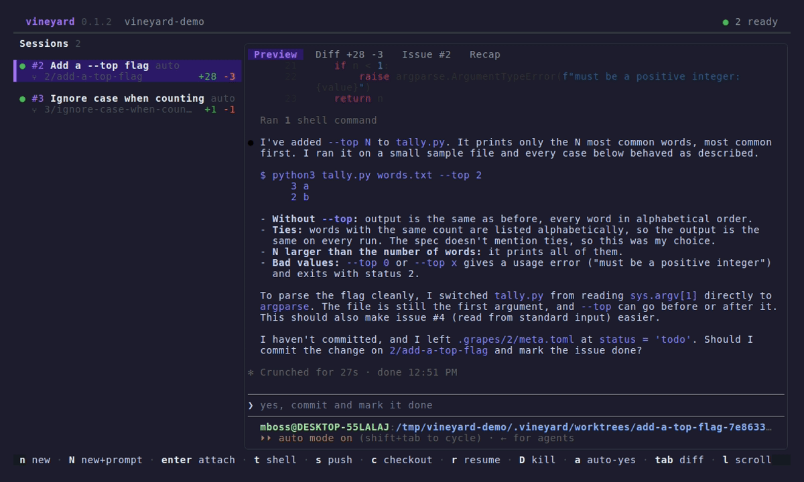

# Vineyard

Run several coding agents in parallel from one terminal. Each agent gets its
own git worktree, branch, and tmux session, so agents never edit the same
checkout. It follows [claude-squad](https://github.com/smtg-ai/claude-squad)'s
model, rebuilt on Bubble Tea v2.



- **Any agent.** Claude Code, Codex, Gemini, Aider, or any other CLI.
- **Live preview.** See each agent's screen, whether it is working or waiting
  for you, and the diff of its branch.
- **Issues.** Vineyard embeds the [grapes](https://github.com/Mibokess/grapes)
  issue tracker. Start an agent from an issue, and see which session works on
  which issue.
- **Persistent.** Agents keep running in tmux after you quit; the next launch
  picks them up.

## Install

Requires git 2.48 or newer and tmux.

Download a Linux or macOS build from the
[releases](https://github.com/mikeryanboss/vineyard/releases), or build with
Go 1.25 or newer:

```sh
go install github.com/mikeryanboss/vineyard@latest
```

## Usage

Run `vineyard` inside a git repository.

| Key | Action |
| --- | --- |
| `n` / `N` | New session / new session with a prompt |
| `enter` | Open the shown tab: attach to the agent from Preview, open the diff tool from Diff, the issue from Issue, the full recap from Recap |
| `o` | Attach to the agent from any tab; `ctrl-q` returns |
| `tab` / `shift+tab` | Switch the pane: preview, diff, issue, recap |
| `l` | Scroll the pane; `esc` returns to the list |
| `t` | Open a shell in the session's worktree |
| `s` | Commit all changes and push the branch |
| `c` | Check out: commit, stop the agent, remove the worktree, keep the branch |
| `r` | Resume a checked-out or stopped session |
| `D` | Kill the session; a branch with commits is kept |
| `a` | Toggle auto-yes, which accepts the agent's permission prompts |
| `i` | Open the grapes issues; on an issue, `a` goes to or starts its session |
| `C` | Edit the configuration |
| `q` | Quit; agents keep running |

Flags: `-p <command>` runs a different agent in new sessions, `-y` turns on
auto-yes for them, and `-i <id>` opens on grapes issue `<id>` as if you pressed
`a` there. `vineyard debug` prints where Vineyard stores its data.

## Configuration

Each repository keeps its settings in `.vineyard/config.toml`; commit it to
share them. Press `C` to edit it in Vineyard, or edit it by hand:

```toml
default_program = "claude"            # profile name or command
branch_prefix = "mboss/"              # defaults to your username
auto_yes = false
worktree_dir = ".vineyard/worktrees"  # relative to the repository, absolute, or ~/...
diff_command = "hunk diff {base} --watch"  # run by enter on the Diff tab

[[profiles]]
name = "claude"
program = "claude"

[[profiles]]
name = "codex"
program = "codex"
```

With more than one profile, the new-session dialog asks which agent to run.

`diff_command` runs through `sh` in the session's worktree, with `{base}`
replaced by the commit where the session's own work begins: where its branch
forks from `origin/HEAD`, even after a rebase or merge. The default is
[Hunk](https://github.com/modem-dev/hunk). When the command is empty or its
program is not installed, `enter` shows Vineyard's own diff full-screen instead.

### Prompt templates

`a` on an issue without a session opens the new-session dialog with a prompt
rendered from a template. Each `.md` file in `.vineyard/templates/` is a
template named after the file; `config.toml` can add more:

```toml
[[templates]]
name = "plan"
text = """
Plan grapes issue #{{.ID}}: {{.Title}}. Do not change code yet.
"""
```

When `.vineyard/templates/` is missing, Vineyard creates it with three
examples, `default`, `bug`, and `research`; edit, delete, or add to them, and
commit them to share them. The dialog preselects the template named after the
issue's first label that has one, else `default`; `←/→` on the Template field
picks another. For an issue with sub-issues, the Build sub-issues checkbox
(`space`) tells the agent to build the sub-issues no other session works on.
Changing the template or the checkbox renders the prompt again, replacing your
edits.

Templates are Go [`text/template`](https://pkg.go.dev/text/template)s over:

| Field | Value |
| --- | --- |
| `.ID`, `.Title`, `.Status` | the issue |
| `.Labels` | its labels |
| `.Parent` | its parent's `.ID`, `.Title`, and `.Status`, or nil |
| `.SubIssues` | each sub-issue's `.ID`, `.Title`, `.Status`, and `.Branch`, the branch of a session working on it or empty |
| `.Blockers` | the issues it is blocked by that are neither done nor cancelled |
| `.BuildSubIssues` | whether Build sub-issues is ticked |

Vineyard removes trailing spaces and repeated blank lines from the result, so
conditional paragraphs need no whitespace control.

A session for an issue starts only when the issue is committed at HEAD, so its
worktree has it.

A `.vineyard/.gitignore` written before templates existed ignores them: add
`!templates/` and `!templates/*` to it, or delete it and Vineyard writes the
current one.

## How it works

A session is a branch, a worktree under `worktree_dir`, and the agent running
in a detached tmux session on Vineyard's own tmux server (`tmux -L vineyard
ls`). The preview mirrors the agent's screen with `tmux capture-pane`. An agent
whose screen keeps changing is working; one whose screen is still is waiting
for you. Attaching hands the terminal to tmux.

You can run several Vineyards on one repository, for example one per terminal
window; they share the session list and show each other's changes within a
second. Vineyard keeps that list and its lock files in `.vineyard/`, and writes
a `.vineyard/.gitignore` so that only the configuration reaches git.

Contributors: see [docs/README.md](docs/README.md).
