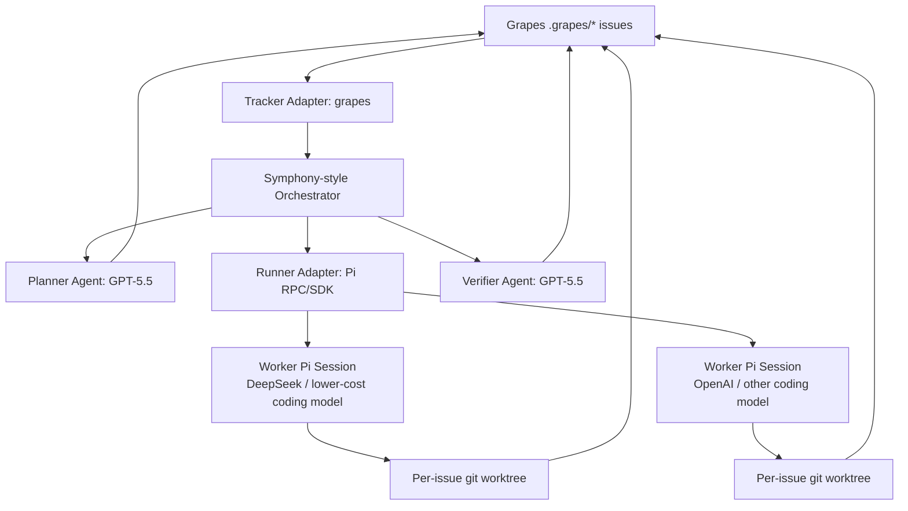
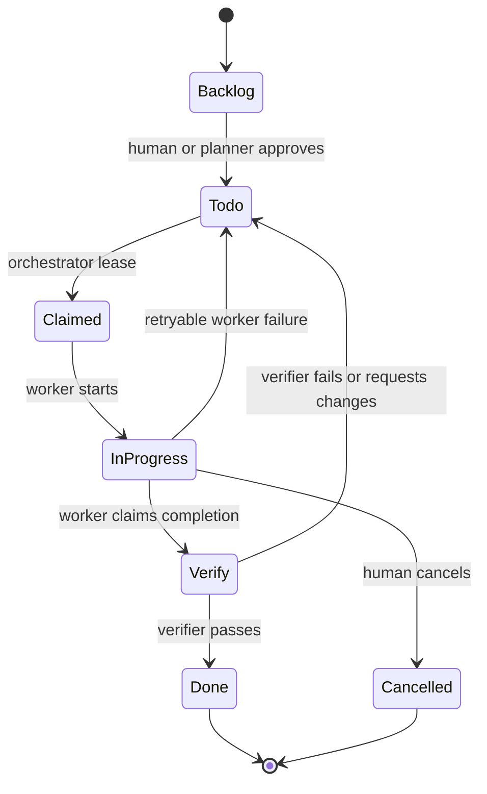
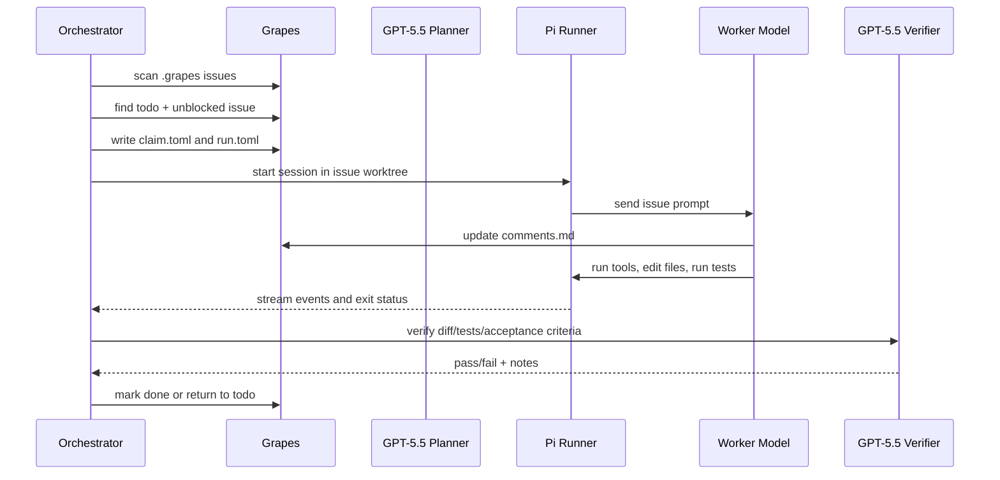

# Grapes + Pi as a Symphony-Style Agent Orchestration System

## Purpose

This note sketches how a local, file-based issue tracker (`grapes`) and the `pi.dev` coding-agent harness could fit into the Symphony orchestration model.

The goal is to preserve Symphony's core architecture:

- a tracker adapter that discovers eligible work,
- an orchestrator that owns scheduling, retries, claims, and reconciliation,
- a per-issue workspace model,
- a coding-agent runner,
- structured observability and recovery,
- human review as the final authority.

The main substitution is:

- Linear becomes Grapes.
- Codex app-server becomes Pi RPC/SDK.
- Model selection becomes explicit routing across high-end planning/verifying models and lower-cost implementation models.

## Context Links

- OpenAI Harness Engineering post: https://openai.com/index/harness-engineering/
- OpenAI Symphony blog post: https://openai.com/index/open-source-codex-orchestration-symphony/
- Symphony repository: https://github.com/openai/symphony
- Symphony service specification: https://github.com/openai/symphony/blob/main/SPEC.md
- Grapes repository: https://github.com/Mibokess/grapes
- Pi coding-agent package: https://github.com/badlogic/pi-mono/tree/main/packages/coding-agent
- Pi README: https://github.com/badlogic/pi-mono/blob/main/packages/coding-agent/README.md
- Pi RPC docs: https://github.com/badlogic/pi-mono/blob/main/packages/coding-agent/docs/rpc.md
- Pi SDK docs: https://github.com/badlogic/pi-mono/blob/main/packages/coding-agent/docs/sdk.md
- Pi custom models docs: https://github.com/badlogic/pi-mono/blob/main/packages/coding-agent/docs/models.md
- Pi extensions docs: https://github.com/badlogic/pi-mono/blob/main/packages/coding-agent/docs/extensions.md
- OpenAI models docs: https://developers.openai.com/api/docs/models

## One-Line Architecture

Use Grapes as the local issue ledger, a Symphony-style orchestrator as the scheduler and control plane, Pi as the worker execution harness, GPT-5.5 for planning and verification, and lower-cost models such as DeepSeek for bounded implementation work.

```text
Grapes issues
  -> Symphony-style orchestrator
    -> planning / verification / escalation model: GPT-5.5
    -> worker runner: Pi RPC or Pi SDK
      -> implementation models: DeepSeek, OpenAI, Anthropic, Gemini, etc.
```

## High-Level Diagram



## Symphony Component Mapping

| Symphony Concept | Proposed System |
| --- | --- |
| Issue tracker | Grapes filesystem issues |
| Linear adapter | Grapes tracker adapter |
| Codex app-server runner | Pi RPC or Pi SDK runner |
| `WORKFLOW.md` | Workflow config for Grapes, Pi, model routing, retries, and verification |
| Candidate issue query | Scan `.grapes/*/meta.toml` |
| Tracker writes | File edits to `meta.toml`, `comments.md`, and optional sidecar files |
| Per-issue workspace | Git worktree per issue |
| Agent session | Pi session running in that worktree |
| Retry queue | Orchestrator memory plus Grapes run/claim sidecars |
| Observability | Pi event stream, Grapes comments, structured logs, optional dashboard |
| Human review gate | PR review or explicit human approval before merge |

## Grapes as the Tracker Adapter

Grapes issues are plain files:

```text
.grapes/<id>/
  meta.toml       # title, status, priority, labels, parent, blocked_by, timestamps
  content.md      # issue description and acceptance criteria
  comments.md     # append-only progress log
```

This maps cleanly to Symphony's tracker abstraction.

The Grapes adapter should expose operations equivalent to:

```text
fetch_candidate_issues()
fetch_issues_by_states(state_names)
fetch_issue_states_by_ids(issue_ids)
```

Internally, these become filesystem scans and TOML/Markdown parsing.

Suggested normalized issue fields:

```text
id: numeric Grapes issue ID
identifier: "#<id>"
title: meta.toml title
state: meta.toml status
priority: mapped from urgent/high/medium/low
labels: meta.toml labels
parent: meta.toml parent
blocked_by: meta.toml blocked_by
body: content.md
comments: comments.md
created_at: meta.toml created
updated_at: meta.toml updated
source_path: .grapes/<id>
```

## State Semantics

The simplest status mapping is:

```text
backlog      = not eligible for dispatch
todo         = eligible candidate
in_progress  = claimed/running
done         = terminal success
cancelled    = terminal stop
```

State machine:



If a stronger review gate is useful, introduce either:

- a new status such as `review`, or
- a verification sidecar file while leaving the core Grapes statuses unchanged.

The sidecar approach keeps Grapes simple:

```text
.grapes/<id>/
  claim.toml
  run.toml
  verification.md
```

## Sidecar Files

Sidecars keep orchestration metadata separate from the human-authored issue fields.

`claim.toml`:

```toml
claimed_by = "orchestrator-host-1"
worker_id = "worker-abc123"
pid = 12345
session_id = "pi-session-id"
worktree = "../.worktrees/issue-42"
claimed_at = 2026-04-28T10:00:00Z
heartbeat_at = 2026-04-28T10:03:00Z
expires_at = 2026-04-28T10:08:00Z
```

`run.toml`:

```toml
attempt = 2
role = "implementation"
runner = "pi"
provider = "deepseek"
model = "deepseek-v4-pro"
thinking = "medium"
started_at = 2026-04-28T10:00:00Z
last_event_at = 2026-04-28T10:04:00Z
last_error = ""
```

`verification.md`:

```markdown
## Verification Result

Status: failed

## Commands

```bash
npm test
```

## Findings

- Acceptance criterion 2 is not satisfied.
- The worker updated the UI but did not add the required validation test.

## Next Action

Return issue to `todo` with verifier notes in `comments.md`.
```

## Orchestration Loop

The Symphony-style loop becomes:

```text
on_tick:
  reconcile_running_issues()
  reload_workflow_config_if_changed()
  validate_dispatch_preconditions()
  fetch Grapes candidate issues
  sort candidates
  dispatch eligible issues while capacity remains
  update observability
  schedule next tick
```

Candidate selection:

```text
eligible if:
  status == "todo"
  no valid active claim exists
  not blocked by unfinished issues
  global concurrency slot available
  per-model / per-provider concurrency slot available
  issue labels do not require unavailable capabilities
```

Reconciliation:

```text
for each active claim:
  if issue is done/cancelled:
    stop worker and clean up claim
  if issue is no longer active:
    stop worker but preserve workspace
  if heartbeat expired:
    mark attempt failed and schedule retry
  if worker exited:
    send to verifier or retry depending on outcome
```

## Pi as the Agent Runner

Pi can run in several modes, but the most relevant are:

- RPC mode over JSONL stdin/stdout.
- SDK mode from Node/TypeScript.

RPC is a good first integration point because it mirrors the app-server pattern from Symphony:

```bash
pi --mode rpc --provider deepseek --model deepseek-v4-pro --session-dir .grapes/42/pi-session
```

The runner adapter should:

1. Start Pi in the per-issue worktree.
2. Set the selected provider/model/thinking level.
3. Send the rendered issue prompt.
4. Stream Pi events into orchestrator state.
5. Watch for agent completion, tool errors, retries, and session stats.
6. Stop or abort the Pi process when the issue leaves an active state.

Pi's RPC protocol provides useful lifecycle events:

```text
agent_start
agent_end
turn_start
turn_end
message_start
message_update
message_end
tool_execution_start
tool_execution_update
tool_execution_end
queue_update
compaction_start
compaction_end
auto_retry_start
auto_retry_end
extension_error
```

These events can populate Symphony-style observability:

```text
running sessions
last message
last event time
tool execution status
token usage
cost
context usage
retry state
```

## Model Routing

The orchestrator should own model routing. Pi should execute the chosen model, not decide task policy by itself.

Recommended roles:

| Role | Suggested Model | Responsibilities |
| --- | --- | --- |
| Planner | GPT-5.5 high/xhigh | Decompose work, create Grapes issues, write acceptance criteria, choose model tier |
| Implementer | DeepSeek / cheaper coding model via Pi | Make bounded code changes in one worktree |
| Complex implementer | GPT-5.5 / stronger coding model via Pi | Handle high-risk or architecture-heavy implementation |
| Verifier | GPT-5.5 high/xhigh | Review diff, run/interpret tests, check acceptance criteria |
| Escalation judge | GPT-5.5 xhigh | Resolve ambiguous failures and conflicting agent outputs |

Routing policy examples:

```text
if issue.labels contains "architecture":
  planner = gpt-5.5:xhigh
  worker = gpt-5.5:high
  verifier = gpt-5.5:high

if issue.labels contains "simple-bug":
  planner = none
  worker = deepseek-v4-pro:medium
  verifier = gpt-5.5:medium

if previous_attempts >= 2:
  worker = gpt-5.5:high
  verifier = gpt-5.5:high

if issue touches security/auth/payment/migrations:
  require human approval before dispatch or before merge
```

## Prompt Construction

A worker prompt should be deterministic and issue-scoped.

Inputs:

```text
AGENTS.md
WORKFLOW.md or orchestrator workflow config
.grapes/<id>/meta.toml
.grapes/<id>/content.md
.grapes/<id>/comments.md
attempt metadata
assigned worktree path
model-specific constraints
```

Worker prompt skeleton:

```markdown
You are working on Grapes issue #42.

## Issue Metadata

- Title: ...
- Status: todo
- Priority: high
- Labels: ...
- Blocked by: ...

## Task

<content.md>

## Prior Context

<comments.md summary or full content>

## Constraints

- Work only in the assigned git worktree.
- Do not modify unrelated files.
- Update `.grapes/42/comments.md` with progress.
- Run the verification commands listed in the issue.
- Do not mark the issue `done`; leave that to the verifier unless explicitly configured otherwise.

## Completion

When finished:

- summarize changed files,
- report verification commands and outcomes,
- leave the issue ready for verifier review.
```

Verifier prompt skeleton:

```markdown
You are verifying Grapes issue #42.

Read:

- `.grapes/42/meta.toml`
- `.grapes/42/content.md`
- `.grapes/42/comments.md`
- the git diff for the assigned worktree
- test output from the worker

Decide whether the acceptance criteria are satisfied.

If satisfied:

- write verification notes,
- mark status `done`.

If not satisfied:

- append concrete findings to `comments.md`,
- set status back to `todo`,
- preserve the worktree for follow-up.
```

## End-to-End Sequence



## Worktree Strategy

Each active issue should get a dedicated worktree:

```text
.worktrees/
  issue-42/
  issue-43/
  issue-44/
```

The worktree path should be recorded in `claim.toml` or `run.toml`.

Benefits:

- parallel implementation without conflicting working directories,
- easy diff extraction per issue,
- clean teardown after terminal states,
- preserved workspace for failed/retry attempts,
- clearer provenance for verifier review.

The orchestrator should decide whether to reuse a worktree on retry. Default recommendation:

- reuse on retry after verifier failure,
- reuse on transient worker failure if the workspace is not corrupted,
- recreate after setup failure,
- preserve until human review if the worker produced a PR or meaningful diff.

## Retry and Escalation

Retries should distinguish failure types.

```text
transient provider error:
  retry same model after backoff

tool/runtime error:
  retry once, then escalate

test failure:
  verifier writes notes and sends issue back to todo

repeated implementation failure:
  escalate to GPT-5.5 worker or human

ambiguous acceptance criteria:
  planner rewrites issue or asks human
```

Recommended retry metadata:

```toml
attempt = 3
last_failure_class = "verification_failed"
last_failure_at = 2026-04-28T10:30:00Z
next_retry_at = 2026-04-28T10:45:00Z
escalated = true
```

## Observability

Minimum operator view:

```text
issue id
title
status
claim owner
worker model
attempt
worktree
last event
last message
last heartbeat
tokens/cost if available
verification status
```

Sources of truth:

- Grapes issue files for durable task state.
- Pi event stream for live session state.
- Orchestrator memory for active scheduling state.
- Structured logs for postmortem and debugging.

Optional dashboard endpoints can mirror Symphony's optional HTTP extension:

```text
GET /api/v1/state
GET /api/v1/issues/<id>
POST /api/v1/refresh
POST /api/v1/issues/<id>/abort
POST /api/v1/issues/<id>/retry
```

## Safety Model

This architecture needs explicit trust boundaries.

Pi intentionally keeps the core minimal and expects users to build permission gates, sandboxing, or confirmation flows through extensions or environment controls. That means the orchestrator should not treat Pi workers as safe by default.

Recommended controls:

- one worktree per issue,
- path-bound worker execution,
- model-specific tool allowlists,
- no secrets in issue files,
- restricted environment variables for lower-trust workers,
- container or VM isolation for autonomous implementation agents,
- no direct merge permissions for workers,
- verifier separate from implementer,
- human approval before merge,
- labels for sensitive areas such as `security`, `auth`, `billing`, `migration`.

Suggested policy:

```text
DeepSeek/lower-cost workers:
  may edit assigned worktree
  may run tests
  may update issue comments
  may not push/merge without review

GPT-5.5 verifier:
  should be read-only by default
  may run tests
  may mark issue done only if configured

Human:
  owns merge approval
  resolves ambiguous product or security decisions
```

## Relationship to the Symphony Spec

This design preserves the Symphony shape while changing implementations.

Unchanged Symphony ideas:

- orchestrator owns scheduling,
- tracker state drives dispatch,
- one workspace per issue,
- worker attempts are retryable,
- terminal issue states stop active runs,
- config and prompts should be versioned,
- observability is required,
- safety posture is deployment-specific and must be documented.

Changed adapters:

- `LinearTrackerAdapter` becomes `GrapesTrackerAdapter`.
- `CodexAppServerRunner` becomes `PiRunner`.

Added policy layer:

- model router,
- verifier gate,
- claim sidecars,
- optional planner/decomposer.

## Suggested First Milestone

Keep the first version intentionally small:

```text
Grapes adapter
  + Pi RPC runner
  + one worker model
  + GPT-5.5 verifier
  + per-issue worktrees
  + structured logs
```

Do not start with recursive planning, many models, dashboards, or distributed workers.

Minimum viable flow:

1. Human creates or approves a Grapes issue by moving it to `todo`.
2. Orchestrator claims it.
3. Orchestrator starts Pi in a worktree.
4. Pi worker implements.
5. Orchestrator runs GPT-5.5 verification.
6. Verifier either marks it `done` or returns it to `todo` with notes.

## Open Questions

- Should `review` be a first-class Grapes status, or should verification live in sidecar files?
- Should workers be allowed to update `meta.toml`, or only `comments.md`?
- Should the verifier mark issues `done`, or should it only recommend status changes?
- Should claims be sidecar files or fields inside `meta.toml`?
- Should worktrees be created by the orchestrator or by Pi extensions?
- Which provider/model combinations should be allowed for sensitive labels?
- How should PR creation fit in: worker-owned, verifier-owned, or human-owned?
- Should planning create child Grapes issues automatically, or only draft them in `backlog`?

## Summary

The clean architecture is:

```text
Symphony-style orchestrator = scheduler and control plane
Grapes = local, versioned tracker
Pi = coding-agent execution harness
GPT-5.5 = planning, verification, escalation
DeepSeek and similar models = bounded implementation workers
```

The key is to keep these roles separate. Grapes should remain the durable task ledger, Pi should remain the worker runtime, and the orchestrator should own scheduling, claims, retries, model routing, and verification policy.
